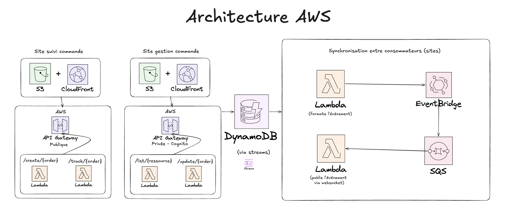

# Suivi Commande AWS

Application serverless de suivi de commandes en temps réel, déployée sur AWS avec SAM.

## Architecture

## Structure

- `web_suivi/`: interface web pour le suivi des commandes
- `web_stock/`: interface web pour la gestion du stock
- `backend/`: logique métier, handlers et intégrations AWS
- `infra/`: notes et fichiers liés à l'infrastructure
- `template.yml`: squelette d'infrastructure AWS serverless

test
